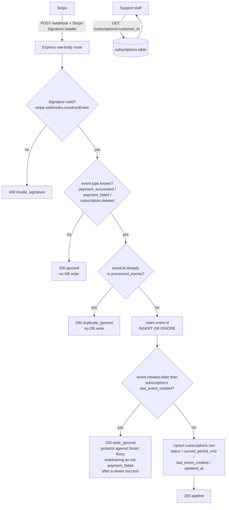

# stripe-subscription-sync

A small, self-contained webhook ingestion service that keeps a local
`subscriptions` table truthful against Stripe Billing, so support staff never
have to open the Stripe Dashboard just to answer "did this person's card go
through?"

## Why this exists

When a renewal payment fails, Stripe enters a retry cycle (Smart Retry) before
finally cancelling the subscription. If your app's database only updates on
the *first* webhook it sees — or double-processes retried events — its status
drifts from the truth in Stripe. This service is the single place that
listens to Stripe, verifies it's really Stripe talking, and applies the
correct, idempotent, order-safe transition to local state.

## Architecture / flow



Everything from "claim event id" through "upsert row" runs inside a single
SQLite transaction, so a crash mid-request can never leave the "have I seen
this event" record out of sync with the actual subscription row.

## Event -> status mapping

| Stripe event                        | Resulting `status` |
|--------------------------------------|---------------------|
| `invoice.payment_succeeded`          | `active`            |
| `invoice.payment_failed`             | `past_due`          |
| `customer.subscription.deleted`      | `cancelled`         |
| anything else                        | ignored, `200 OK`, no write |

## Schema

```sql
CREATE TABLE subscriptions (
  stripe_subscription_id TEXT PRIMARY KEY,
  stripe_customer_id     TEXT NOT NULL,
  status                 TEXT NOT NULL,   -- active | past_due | cancelled
  current_period_end     INTEGER,         -- unix timestamp
  last_event_created     INTEGER NOT NULL DEFAULT 0, -- guards against out-of-order delivery
  updated_at             TEXT NOT NULL
);

CREATE TABLE processed_events (
  event_id     TEXT PRIMARY KEY,          -- Stripe event.id, enforces idempotency
  event_type   TEXT NOT NULL,
  processed_at TEXT NOT NULL
);
```

## How idempotency and ordering are handled

1. **Duplicate delivery** (Stripe sends the exact same `event.id` twice,
   which it explicitly warns can happen): `processed_events` has `event_id`
   as its primary key. The insert uses `INSERT OR IGNORE`; if zero rows
   change, we already handled it and skip straight to `200 OK`.
2. **Out-of-order delivery** (a `payment_failed` retry arrives *after* the
   `payment_succeeded` that resolved it, because webhook delivery order
   isn't guaranteed): every subscription row stores `last_event_created`,
   the Stripe `event.created` timestamp of whichever event last touched it.
   An incoming event is only applied if its `created` is `>=` the stored
   value. A late, stale `payment_failed` from before the recovery is
   detected and dropped instead of overwriting `active` with `past_due`.

Both checks happen inside one SQLite transaction (`db.transaction(...)`), so
"mark event as seen" and "update the row" always succeed or fail together.

## Endpoints

- `POST /webhook` — Stripe webhook receiver. Requires a valid
  `Stripe-Signature` header; the raw body is verified with
  `stripe.webhooks.constructEvent`. Always responds before it does anything
  risky, and returns `5xx` only on a genuine processing error so Stripe will
  retry (it does **not** retry on `4xx`, so bad signatures are `400`, not
  `500`).
- `GET /subscriptions/:stripe_customer_id` — returns the locally stored
  subscription record(s) for that customer. `404` if unknown, `400` if the id
  doesn't look like a Stripe customer id (`cus_...`).
- `GET /healthz` — trivial liveness check.

## Performance / reliability notes

- **better-sqlite3** is used synchronously and in-process: no connection
  pool, no async driver overhead, no leaked file handles or dangling
  promises on shutdown.
- All SQL is **prepared once** at module load and reused — no per-request
  query compilation.
- The webhook route uses `express.raw()` scoped to just that route (required
  for signature verification), while every other route uses the normal JSON
  parser — both with explicit body-size limits to bound memory use.
- `SIGINT`/`SIGTERM` handlers close the HTTP server and the SQLite handle
  explicitly, with a hard-exit fallback, so nothing lingers on redeploy.
- Errors are funneled through one centralized Express error handler instead
  of ad hoc `try/catch` -> inconsistent response shapes.

## Setup

```bash
git clone <this-repo>
cd stripe-subscription-sync
npm install
cp .env.example .env
```

You need a **Stripe test-mode webhook signing secret** in `.env`. Two ways
to get one:

**Option A — Stripe CLI (recommended, exercises real Stripe payloads):**

```bash
stripe login
stripe listen --forward-to localhost:4242/webhook
# copy the "whsec_..." it prints into .env as STRIPE_WEBHOOK_SECRET
```

**Option B — Dashboard:** create a test-mode webhook endpoint pointing at
your tunnel URL (e.g. via `ngrok http 4242`), and copy its signing secret.

## Running it

```bash
npm start
# stripe-subscription-sync listening on port 4242
```

## Verifying the happy path

**With the Stripe CLI** (real, correctly-signed events):

```bash
stripe trigger invoice.payment_succeeded
curl localhost:4242/subscriptions/<cus_id_from_stripe_dashboard>
```

**Without the CLI** (no external network needed — the included script signs
payloads the same way Stripe does, using your `STRIPE_WEBHOOK_SECRET`):

```bash
npm run test:happy
```

Expected: `invoice.payment_succeeded` is accepted (`200 applied`), and the
follow-up `GET /subscriptions/cus_test_demo001` shows `"status": "active"`.

## Verifying failure -> recovery (the important one)

```bash
npm run test:recovery
```

This script walks through, against your running server:

1. `invoice.payment_failed` → expect `status: past_due`.
2. The **same** `payment_failed` event redelivered (simulating a Stripe
   retry-of-delivery) → expect `duplicate_ignored`, status unchanged.
3. `invoice.payment_succeeded` (the retry that worked) → expect
   `status: active`.
4. A **stale** `payment_failed` event, timestamped *before* the success in
   step 3 but delivered *after* it → expect `stale_ignored`, and — critically
   — the final `GET` must still show `"status": "active"`, not `past_due`.

You can also try `stripe trigger customer.subscription.deleted` (or
`npm run test:cancel` — via `node scripts/send-test-event.js cancel`) to see
the cancellation path.

## Project layout

```
src/
  server.js              Express app, signature verification, routing, shutdown
  webhookHandler.js       Event -> status-transition mapping + idempotency/ordering
  db.js                   SQLite schema, prepared statements, transactions
  routes/subscriptions.js GET /subscriptions/:stripe_customer_id
scripts/
  send-test-event.js      Locally-signed test payloads (happy / recovery / cancel)
```
